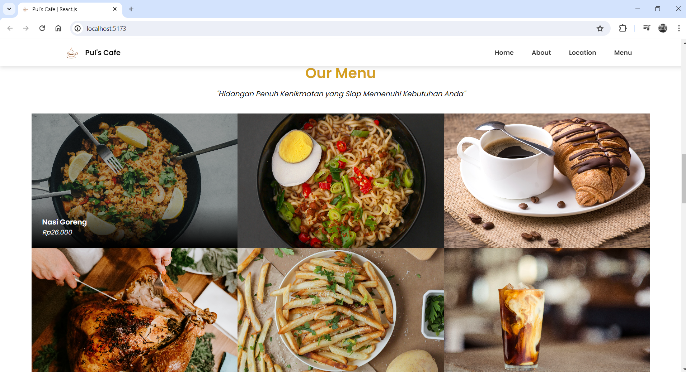
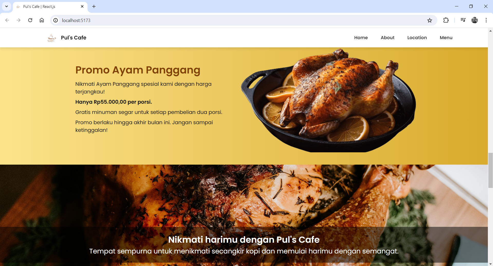

# Pul's Cafe Website (React.js + Vanilla CSS)

#### 👌 <i>Muhammad Syaiful Rahman</i> 👌 

## Technology

- React.js
- Vanilla CSS

## Notes
✔ Halaman menggunakan React.js  
✔ Breakdown by Component  
✔ Data melalui props  
✔ Data perulangan sudah dilooping  

## Screenshots (Preview)

  

  

  

